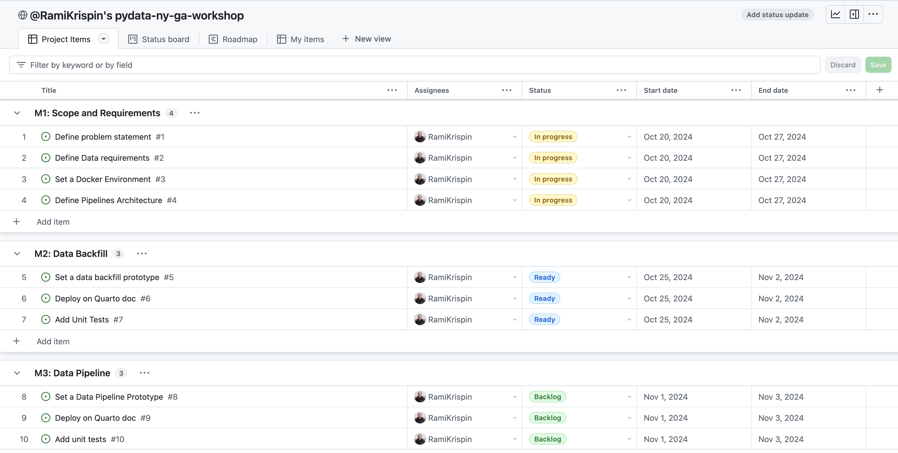
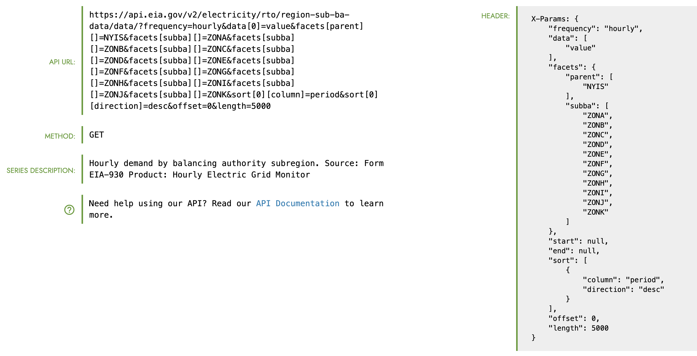

# Deploy and Monitor ML Pipelines with Python, Docker, and GitHub Actions


WIP...

Materials for the Deploy and Monitor ML Pipelines with Python, Docker, and GitHub Actions workshop at the [PyData NYC 2024 Conference](https://pydata.org/nyc2024/).

**When 📆:** Wednesday, November 6th, 10:50 AM EST

The workshop is based on the LinkedIn Learning course - [Data Pipeline Automation with GitHub Actions](https://www.linkedin.com/learning/data-pipeline-automation-with-github-actions-using-r-and-python/), code is available [here](https://github.com/LinkedInLearning/data-pipeline-automation-with-github-actions-4503382).


**Description:** The workshop will focus on different deployment designs of machine learning pipelines using open-source applications and free-tier tools. Demonstrating with the US hourly demand for electricity live data from the EIA API, we will learn how to deploy data and ML pipeline with Python, GitHub Actions, and Docker. This includes the use of open-source tools such as Nixtla's mlforecast library to create a forecast, MLflow and pytest to monitor the health of the data and the model's success. Last but not least, we will use Quarto doc to set up the monitoring dashboard and deploy it on GitHub Pages.


<figure>
 </a>
<figcaption> New York City (created with Midjourney)</figcaption>
</figure>

<br>
<br />


## Table of Content


## Milestones
To organize and track the project requirements, we will set up a GitHub Project, create general milestones, and use issues to define sub-milestone. For setting up a data/ML pipeline, we will define the following milestones:
- **Define Scope and Requirements:**
    - General project scope
    - Pipeline scope:
      - Data pipeline
      - Forecasting pipeline
    - Set a development environment:
      - Set a Docker image
      - Update the Dev Containers settings
- **Data Backfill:**
  - Set a data backfill process
  - Deploy the process in a Quarto doc
  - Productionize - add unit tests
- **Data pipeline:**
    - Create pipeline schema/draft
    - Build a prototype
    - Test deployment on GitHub Actions
    - Productionize the pipeline - set unit tests
- **ML Pipeline:**
    - Set experiment
    - Set backtesting function
    - Define forecasting models
    - Test and evaluate the models' performance
    - Select the best model for deployment
    - Deploy the pipeline with Quarto doc to GitHub Action
- **Dashboard:**
    - Define the dashboard scope
    - Set a Quarto/Shinylive dashboard
  
- **Documentation:**
    - Set project documentation
    - Slides


The milestones are available in the repository [issues section](https://github.com/RamiKrispin/pydata-ny-ga-workshop/milestones), and you can track them on the [project tracker](https://github.com/users/RamiKrispin/projects/8/).


<figure>
 </a>
<figcaption> The project tracker</figcaption>
</figure>

<br>
<br />


## Scope

- **Goal:** Forecast the hourly demand for electricity in the New York Independent System Operator subregion (NYIS). This includes the following 11 providers:
    - West - NYIS (ZONA)
    - Genesee - NYIS (ZONB)
    - Central - NYIS (ZONC)
    - North - NYIS (ZOND)
    - Mohawk Valley - NYIS (ZONE)
    - Capital - NYIS (ZONF)
    - Hudson Valley - NYIS (ZONG)
    - Millwood - NYIS (ZONH)
    - Dunwoodie - NYIS (ZONI)
    - New York City - NYIS (ZONJ)
    - Long Island - NYIS (ZONK)

- **Forecast Horizon:** 24 hours

- **Refresh:** Every 24 hours

### Data 
The data is available on the [EIA API](https://www.eia.gov/opendata/), the API [dashboard provides](https://www.eia.gov/opendata/browser/electricity/rto/region-sub-ba-data?frequency=hourly&data=value;&facets=parent;subba;&parent=NYIS;&subba=ZONA;ZONB;ZONC;ZOND;ZONE;ZONF;ZONG;ZONH;ZONI;ZONJ;ZONK;&sortColumn=period;&sortDirection=desc;) the GET setting to pull the above series.

 
<figure>
 </a>
<figcaption> The GET request details from the EIA API dashboard</figcaption>
</figure>

<br>
<br />


Below is the header of the GET request:

``` json
{
    "frequency": "hourly",
    "data": [
        "value"
    ],
    "facets": {
        "parent": [
            "NYIS"
        ],
        "subba": [
            "ZONA",
            "ZONB",
            "ZONC",
            "ZOND",
            "ZONE",
            "ZONF",
            "ZONG",
            "ZONH",
            "ZONI",
            "ZONJ",
            "ZONK"
        ]
    },
    "start": null,
    "end": null,
    "sort": [
        {
            "column": "period",
            "direction": "desc"
        }
    ],
    "offset": 0,
    "length": 5000
}
```


### General Requirements
- The following functions:
    - Data backfill function
    - Data refresh function
    - Forecast function
    - Metadata function
- Docker image
- EIA API key

## Set a Development Environment

To make the deployment to GitHub Actions seamless, we will use Docker. In addition, we will set up a development environment using VScode and the Dev Containers extension.

### Docker Settings

To make the deployment to GitHub Actions seamless, we will use Docker. This will enable us to ship our code to GitHub Actions using the same environment we used to develop and test our code. We will use the below `Dockerfile` to set the environment:


```Dockerfile
FROM python:3.10-slim AS builder

ARG QUARTO_VER="1.5.56"
ARG VENV_NAME="my_project"
ENV QUARTO_VER=$QUARTO_VER
ENV VENV_NAME=$VENV_NAME
RUN mkdir requirements

COPY install_requirements.sh requirements/


COPY requirements.txt requirements/
RUN bash ./requirements/install_requirements.sh $VENV_NAME


FROM python:3.10-slim

ARG QUARTO_VER="1.5.56"
ARG VENV_NAME="my_project"
ENV QUARTO_VER=$QUARTO_VER
ENV VENV_NAME=$VENV_NAME

COPY --from=builder /opt/$VENV_NAME /opt/$VENV_NAME

COPY install_requirements.sh install_quarto.sh install_dependencies.sh requirements/
RUN bash ./requirements/install_dependencies.sh
RUN bash ./requirements/install_quarto.sh $QUARTO_VER

RUN echo "source /opt/$VENV_NAME/bin/activate" >> ~/.bashrc

```


We will use the [Python slim image](https://hub.docker.com/layers/library/python/3.10-slim/images/sha256-a31c40a8a991eeb3f3923b9c4efc94e269589b1f35b6987a587550a6cc182245?context=explore) as our baseline, along with a Multi-Stage build approach, to make the image size as minimal as possible.

To make the image size as minimal as possible, we will use the [Python slim image](https://hub.docker.com/layers/library/python/3.10-slim/images/sha256-a31c40a8a991eeb3f3923b9c4efc94e269589b1f35b6987a587550a6cc182245?context=explore) as our baseline along with a Multi-Stage build approach. More details about the Multi-Stage build are available in the Docker [documentation](https://docs.docker.com/build/building/multi-stage/) and this [tutorial](https://medium.com/p/41b94ebe8bb3).

We will use the below Bash script (`build_image.sh`) to build and push the image to the Docker Hub:

``` bash
#!/bin/bash

# Image settings
user_name=rkrispin
image_label=pydata_ny_workshop
image_tag=0.0.2
image_name=$user_name/$image_label:$image_tag
venv_name="pydata-ny-workshop"

echo "Build the docker"

docker build . -f Dockerfile \
               --progress=plain \
               --build-arg QUARTO_VER=$QUARTO_VER \
               --build-arg VENV_NAME=$venv_name \
               -t $image_name

if [[ $? = 0 ]] ; then
echo "Pushing docker..."
#docker push $image_name
else
echo "Docker build failed"
fi
```


The Dockerfile and its supporting files are under the [docker folder](https://github.com/RamiKrispin/pydata-ny-ga-workshop/tree/main/docker).

**Note:** GitHub Actions, by default, does not support ARM64 processer but AMD64 (e.g., Intel). Therefore, if you are using Apple Silicon (M1/M2/M3) or any other ARM64-based machine, you will have to use [Docker BuildX](https://docs.docker.com/reference/cli/docker/buildx/) or similar to build the image to AMD64 architecture. 

### VScode Dev Containers Setting

We will use the following `devcontainer.json` file to set the development environment:
```json
{
    "name": "PyData NY 2024 Workshop",
    "image": "docker.io/rkrispin/pydata_ny_workshop:0.0.2",
    "customizations": {
        "vscode": {
            "settings": {
                "python.defaultInterpreterPath": "/opt/pydata-ny-workshop/bin/python3",
                "python.selectInterpreter": "/opt/pydata-ny-workshop/bin/python3"
            },
            "extensions": [
                // Container
                "ms-azuretools.vscode-docker",
                "ms-vscode-remote.remote-containers",
                //Python
                "ms-python.python",
                "ms-python.vscode-pylance",
                // HTML
                "ms-vscode.live-server",
                // Documents
                "yzhang.markdown-all-in-one",
                "quarto.quarto",
                "redhat.vscode-yaml",
                "ms-toolsai.jupyter",
                //Code
                "oderwat.indent-rainbow",
                // Data
                "mechatroner.rainbow-csv",
                "ms-toolsai.datawrangler"
            ]
        }
    },
    "remoteEnv": {
        "EIA_API_KEY": "${localEnv:EIA_API_KEY}"
    }
}
```


If you want to learn more about setting up a dockerized development environment with the Dev Containers extension, please check the [Python](https://github.com/RamiKrispin/vscode-python) and [R](https://github.com/RamiKrispin/vscode-python) tutorials.


## Resources

- Docker documentation: https://docs.docker.com/
- Dev Containers Extension: https://marketplace.visualstudio.com/items?itemName=ms-vscode-remote.remote-containers
- GitHub Actions documentation: https://docs.github.com/en/actions

## License
This tutorial is licensed under a [Creative Commons Attribution-NonCommercial-ShareAlike 4.0 International](https://creativecommons.org/licenses/by-nc-sa/4.0/) License.

